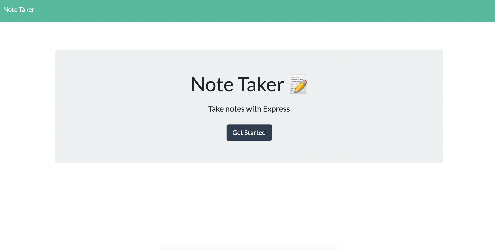

## Title
  notesApp

  ## Description
  Note Taking Application deployed to Heroku. uses node.js, express, mysql, and JSON files

  ## Table of Contents
  1. [Installation](#Installation)
  2. [Usage](#Usage)
  3. [License](#License)
  4. [Contributing](#Contributing)
  5. [Tests](#Tests)
  6. [Questions](#Questions)

  ## Installation
  git clone repository, run server.js, and visit localhost, or visit deployed application on heroku here:
   
  https://surfinnotesapp.herokuapp.com/

  ## Usage
  Write and save notes using express.js

  ## License
  None

  ## Contributing
  Contributors Welcome

  ## Tests

  ## Questions
  https://github.com/surfinsofia

  https://www.linkedin.com/in/surfinsofia

  Reach me with questions by email:
  asofiae96@gmail.com

  